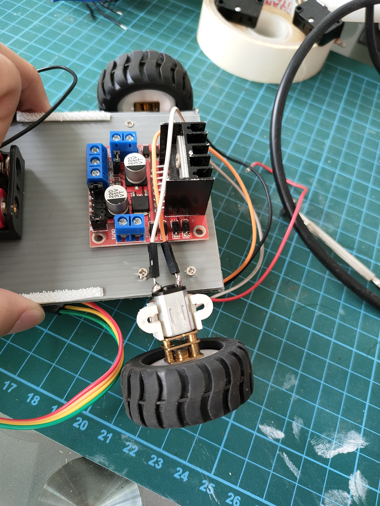
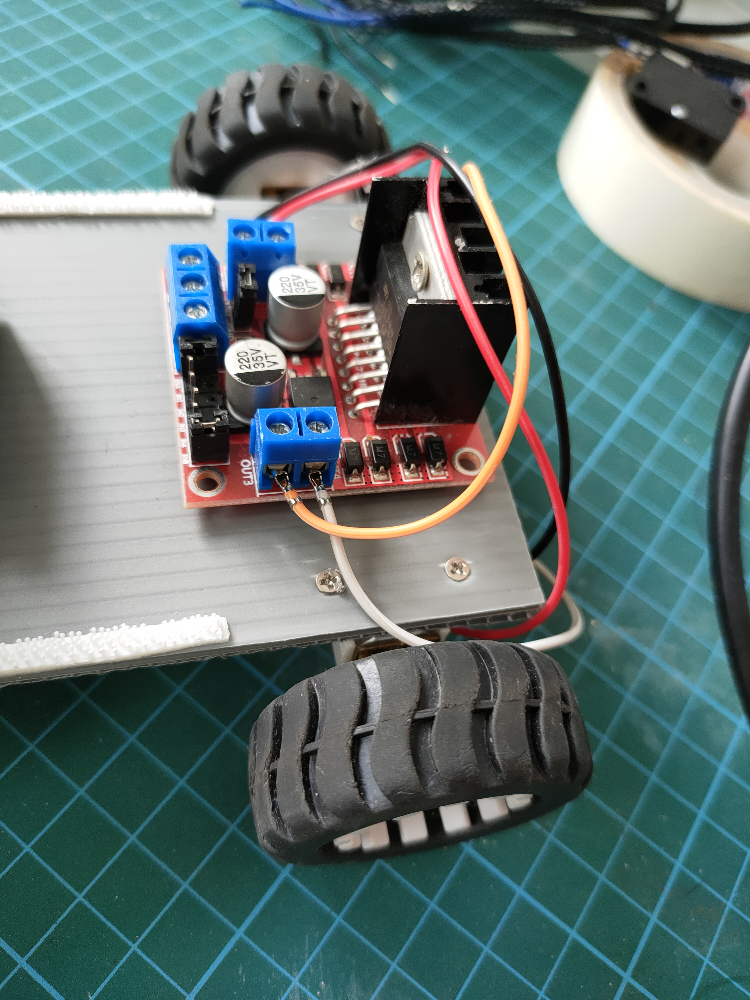
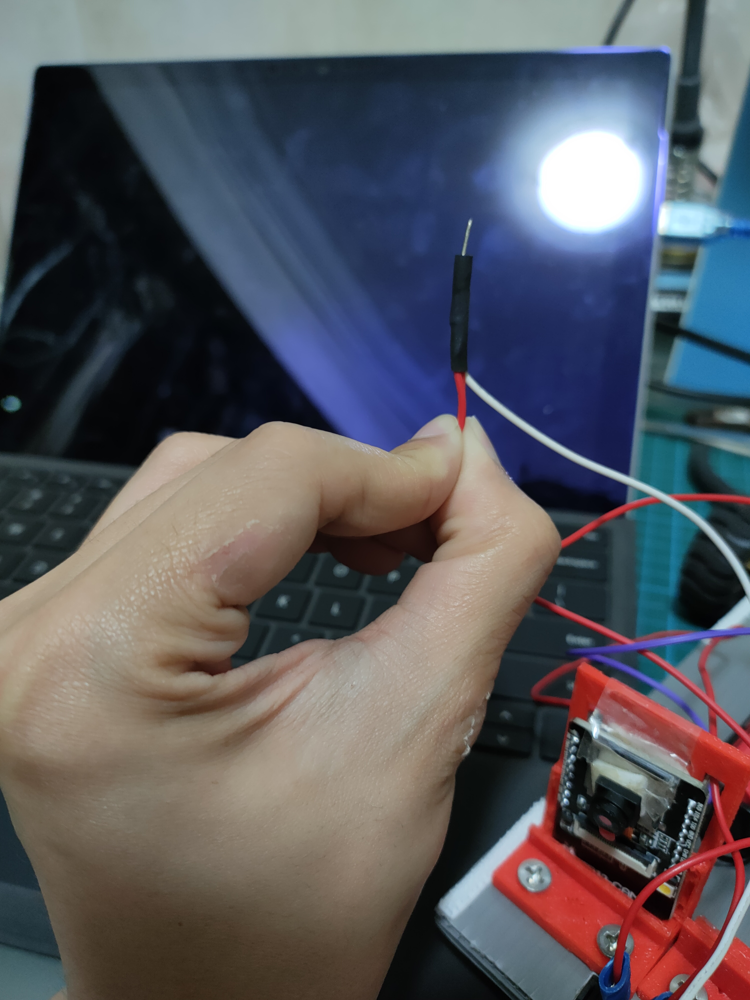
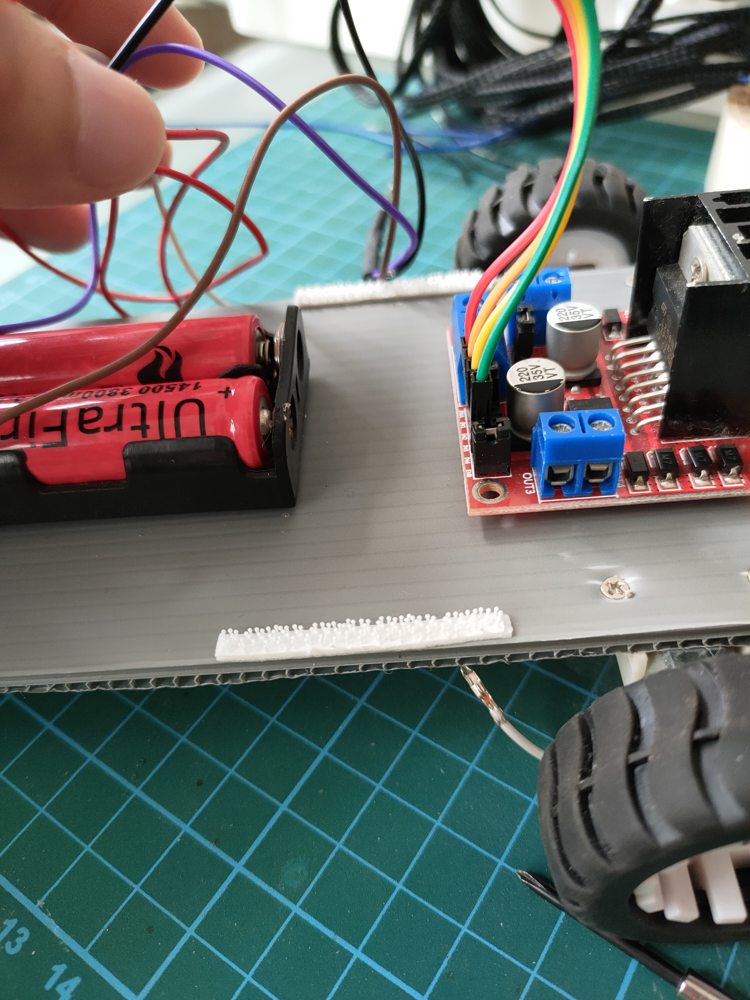
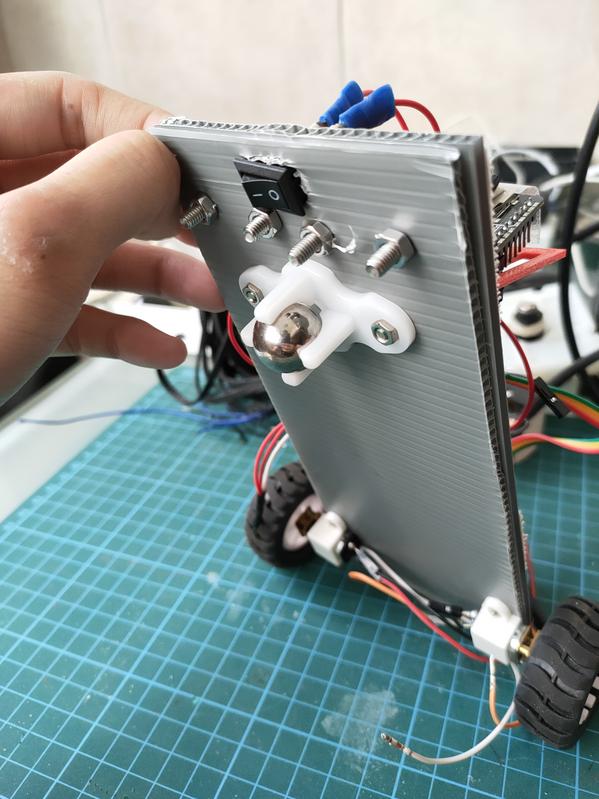
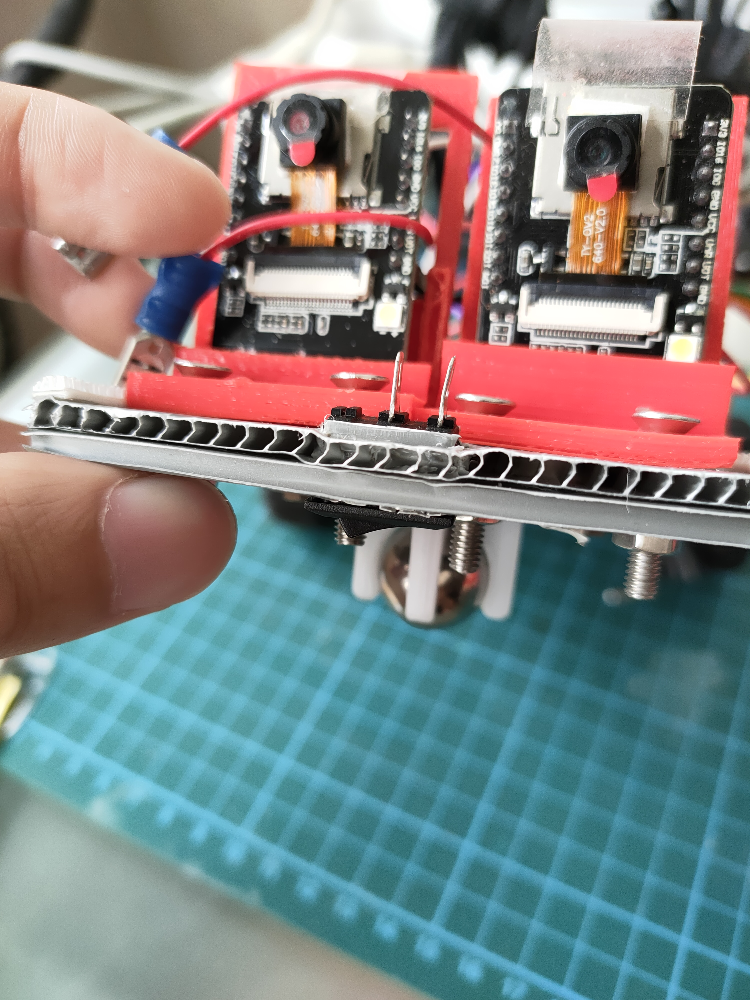
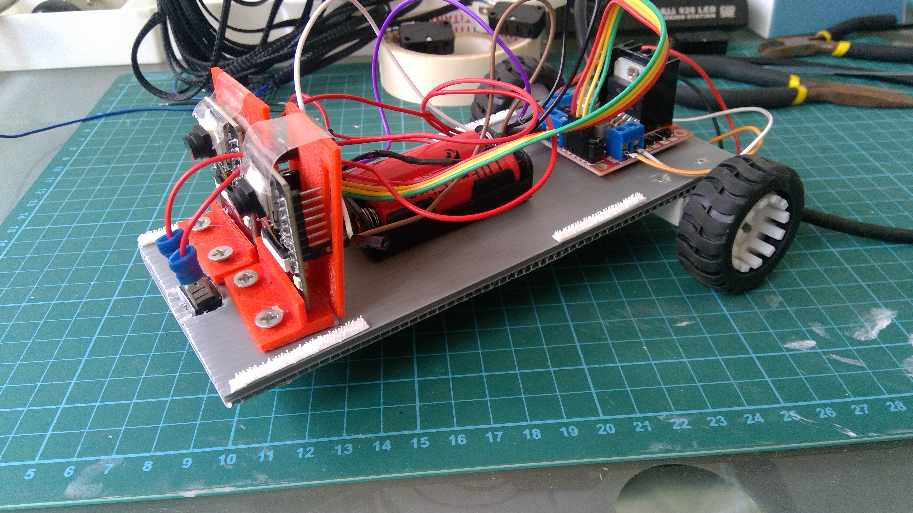
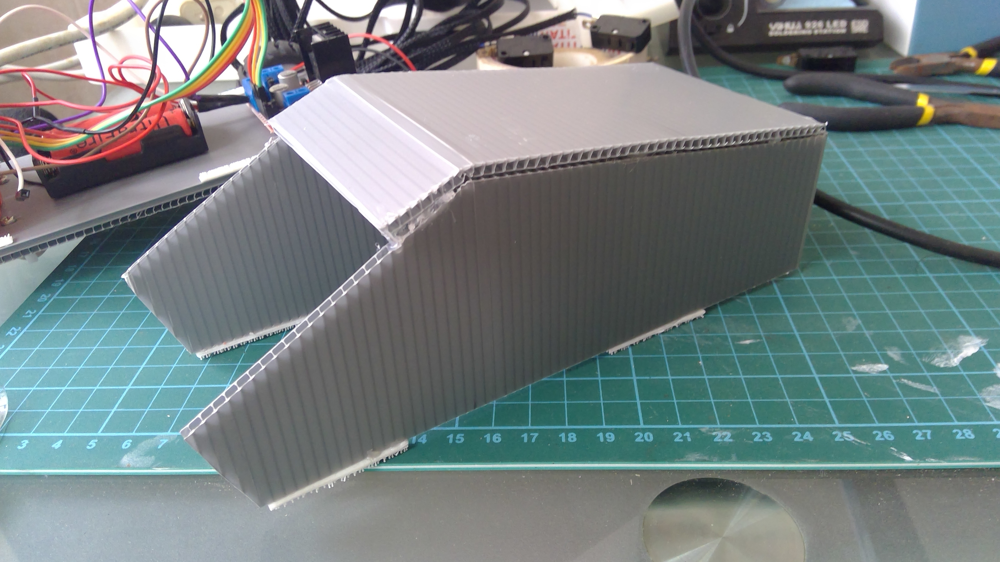
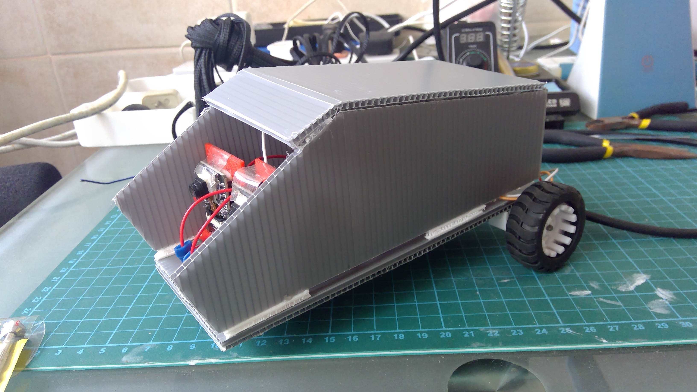

# NM6011

This repository will contain the the files that need to be uploaded to the ESP32-CAM board and the instructions to build the vehicle.

## Materials needed

1. 1 x Corrugated Board
2. 2 x Wheel + Motor (w/ screws and nuts)
3. 1 x Front/Castor Wheel
4. 1 x Battery Holder
5. 4 x Rechargeable AA Batteries
6. 1 x ESP32-CAM
7. 1 x FTDI Programmer (or Arduino Uno)
8. 1 x Switch
9. Jumper wires
10. Tape
11. 3M Velcro (optional)
12. Hot glue (optional)
13. [3D printed ESP32-CAM board holders](https://github.com/leeyanhuilyh/ESP32-CAM_Holder) (optional)

# Software

## Pre-requisites

Firstly, please download and install [PlatformIO](https://platformio.org/install/ide?install=vscode).

Next, clone this repository into your working directory. For the purpose of this tutorial, assume this is the working directory.

```
C:\repo\NM6011
```

You would also need an [FTDI programmer](https://randomnerdtutorials.com/program-upload-code-esp32-cam/) to upload the code onto the ESP32-CAM. If you have an Arduino Uno, it can also be used as an FTDI programmer. Please follow [this](https://technoreview85.com/how-to-program-esp-32-cam-using-arduino-uno-board/) guide instead

## Starting a new project on PlatformIO

Follow the official guide on [PlatformIO](https://docs.platformio.org/en/latest/integration/ide/vscode.html#quick-start) to start a new project.

Choose the "AI-Thinker ESP32-CAM" as the Board and select Arduino as the Framework.

Choose a name for your project. This would be your working directory from here onwards.

## Extracting the files into your project folder

Extract the files found in the "src" folder into your working directory's "src" folder.

```
C:\repo\NM6011\src
```

You should then have these files in your "src" folder

```
app_camera.h
decode.c
identify.c
main.cpp
qrcode_recognize.h
quirc_internal.h
quirc.c
quirc.h
version_db.c
```

Replace the platformio.ini file in your working directory with the downloaded platformio.ini file.

## Editing WiFi settings

Go to main.cpp and search for the lines:

```
const char* ssid = ...;
const char* password = ...;
```

Replace this with your WiFi Access Point credentials

(Note: the best way to ensure stable connection with your vehicle is to have your vehicle connect to your laptop's hotspot, and have your laptop connect to your mobile phone's hotspot, with the mobile phone having only the mobile data switched on [1]. Don't worry, your mobile data would not be used during the camera stream as no actual connection to the internet is made. You are merely creating a subnet that only you have access to, hence ensuring minimal interference for the vehicle.)

## Preparing to upload the code


To begin uploading to the ESP32-CAM, you would need an FTDI programmer. Please follow the wiring guide above. Take note that a jumper wire has to be connected from IO0 to GND.


Once it's wired up properly, build your code first, then upload the code.


If there are any issues with the code, connect the ESP32-CAM board via the programmer and use the serial monitor to troubleshoot.

# Hardware

## Building the vehicle


(Note: some pictures may show 2 ESP32-CAM boards. Don't worry about this as the instructions here are written for using 1 ESP32-CAM board only.)

1. Cut a 8 x 20 cm of the corrugated boards.
2. Cut another piece of the same dimension. (Note: cut the board with the tracks facing the perpendicular direction for better reinforcement)

3. Glue the two pieces of cut boards together.
4. Solder 2 jumper wires to the contacts of the motors.
5. Affix the L298N motor driver to the end of one side of the board.
6. Position the motor holders such that they line up in the middle of the L298N motor driver.

7. Poke holes where the holes of the motor holder should be.
8. Secure the motors (with the wires facing inwards) and connect the motor wires with the L298N driver.

9. Prepare the wiring for the battery holder. The + terminal should be able to connect to the +12V terminal on the L298N, and the 5V end on the ESP32-CAM board. Consider using the male end of the jumper wire for the connector and heat shrink the 2 wires to secure the connection.

10. Leave about 3cm of space between the L298N and affix the battery holder.

11. Connect the battery holder with the L298N
12. Position the front wheel on the underside of the body. Poke holes where the screws should go. The screws should be immediately after (or just a small gap) the battery holder.

13. Screw in the front wheel.
14. 3D print the ESP32-CAM holders. 3D models available [here](https://github.com/leeyanhuilyh/ESP32-CAM_Holder). Alternatively, use the corrugated board to make a holder for the ESP32-CAM board.
15. Screw down the holders where there is space (or tape down the holders if you are making one using corrugated board).
16. Finally, cut out a small hole in front of the holders for the switch to fit through.

17. Connect the switch. This could be done either by soldering the wires to the contacts, or by using quick connects.
18. Upload the code to the boards (Please refer to previous sections).
19. Make the connections of the ESP32-CAM and the switch.
20. Test it out!


## Making the cover of the vehicle

1. Place 4 thin velcro strips along the side of the sides of the vehicle.

2. There are 3 parts to the cover: the left and right side, and the top. Plan out the design you would like to make. A few tips to note: 
  * The sides should be reinforced with 2 corrugated boards just like the body, so as to provide enough space to place the velcro strips.
  * The length should be at least 20cm so as to cover the length of the body.
  * Use hot glue to make sure that the boards stick together well.

3. Put the cover onto the vehicle. Make sure that the wires can be packed into the vehicle, and that the cover of the vehicle does not obstruct the view of the cameras.


## Connecting to the vehicle

Upon powering up the vehicle, the LED would flash a couple of times. This means that it is connecting to the WiFi access point. When it stops flashing, it means that it has successfully connected to the access point. If it continues to flash, please check your WiFi setup or credentials.

Enter 192.168.137.20 into your web browser on either your phone or your PC. You should see a page similar to the one below.


Try moving the vehicle around with the controls and scanning a few QR codes [2].

### Additional notes:

[1] The rationale for this is the ESP32-CAM always assigns a new IP address to the ESP32-CAM upon connection, but we need a static IP address in order to control the ESP32-CAM board consistently, and without hassle. Only a PC hotspot is able to achieve this. Mobile phone hotspots do not offer the feature of assigning a static IP address.

[2] The QR scanner only works on specially encrypted QR codes. Scanning normal QR codes would only produce gibberish.

To fix "Brownout detector was triggered", connect the 5V on the ESP32-CAM to the batteries, instead of the programmer. This sometimes happen because there would be a spike in power draw from the board when it attempts to connect to the WiFi access point. The power from your laptop might not be sufficient for the board, hence triggering the board's brownout detector.

If the HTML page does not load, but your board is able to connect to the WiFi access point, try the recommended hotspot setup in the section "Editing WiFi Settings". If it still does not work, try closing your browser and opening a new browser window just to access the board's IP address. You may also try other browsers.
